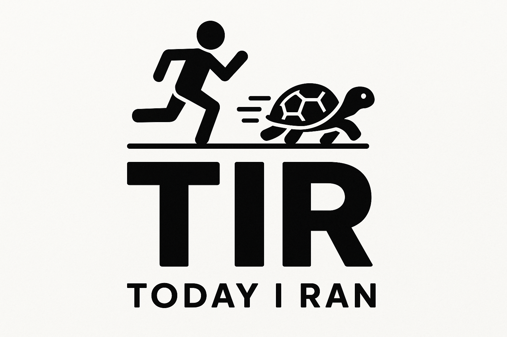

# "거북이처럼 천천히 꾸준히"

## 📌 소개

이 저장소는 러닝 데이터를 보관하고, 주간/월간/연간으로 관리하기 위해 만들어졌습니다.

코로스 페이스 3 측정 기반 데이터입니다.
굳이 데이터를 다시 정리하는 이유는 데이터를 다시 살펴보고, 계획 - 실행 - 회고를 통해 꾸준히 건강하게 성장하기 위해서입니다.

---

## 📝 기록 예시

### plan

```markdown
# 🗓️ 2025년 4월 4주차 러닝 계획

---

| 요일 | 종류            | 목표 거리 |           목표 페이스           | 메모                        |
| :--: | :-------------- | :-------: | :-----------------------------: | :-------------------------- |
|  월  | 휴식            |     -     |                -                | 근육 회복, 스트레칭 집중    |
|  화  | 이지런          |   5 km    |            7'00"/km             | 가볍게 몸 풀기              |
|  수  | 인터벌 트레이닝 |   6 km    | 변동 (400m 빠르게, 400m 천천히) | 속도감 향상 목표            |
|  목  | 휴식            |     -     |                -                | 컨디션 체크 및 준비         |
|  금  | 템포런          |   8 km    |            6'30"/km             | 꾸준한 속도 유지 연습       |
|  토  | 롱런            |   12 km   |            7'30"/km             | 페이스 유지하며 오래 달리기 |
|  일  | 회복런          |   4 km    |            7'45"/km             | 천천히, 짧게 달리며 회복    |

---

## 🎯 주간 목표

- 총 목표 거리: 35 km
- 주요 훈련 포인트: 인터벌 집중, 롱런 거리 확보

---

## ✏️ 주간 메모

- 인터벌 트레이닝 시 부상 주의
- 롱런 다음 날은 반드시 스트레칭과 아이싱 진행
- 전체 페이스를 강제하지 않고 자연스럽게 조절하기
```

### record

```markdown
# 📅 2025-04-27 러닝 기록

- 📍 Location: 야외
- 🏃‍♂️ Distance: 7.5 km
- ⏱️ Duration: 12:34:56
- 🏃‍♂️ Pace: 7'04" / km
- ❤️ Heart Rate: 평균 142 bpm / 최대 159 bpm
- 🌤️ Weather: 맑음
- 🧠 Feeling: 좋음
- 🥤 Hydration: 충분
- 🍽️ Pre-run Nutrition: 바나나 1개
- 👟 Shoes: 나이키 스트럭처 25
- ✏️ Memo
  - 체감 피로도 낮았고, 마지막 1km 구간에서 자연스럽게 속도가 올랐다.
  - 언덕 코스였지만 컨디션이 매우 좋았음.
```

### review

```markdown
# ✅ 2025년 4월 4주차 러닝 리뷰

---

## 📋 주간 계획 요약

- 주간 목표 거리: 35km
- 주요 훈련: 인터벌, 롱런, 템포런

---

## 🏃‍♂️ 실제 실행 결과

| 요일 | 계획       | 실제 실행  | 차이 | 메모                  |
| :--: | :--------- | :--------: | :--: | :-------------------- |
|  월  | 휴식       |    휴식    |  -   | 근육 회복 완료        |
|  화  | 이지런 5km | 이지런 5km | 일치 |                       |
|  수  | 인터벌 6km | 인터벌 5km | -1km | 마지막 세트 생략      |
|  목  | 휴식       |    휴식    |  -   |                       |
|  금  | 템포런 8km | 템포런 8km | 일치 | 좋은 페이스 유지      |
|  토  | 롱런 12km  | 롱런 13km  | +1km | 컨디션 좋아 추가 거리 |
|  일  | 회복런 4km | 회복런 4km | 일치 |                       |

---

## 📈 달성률

- 목표 거리: 35km
- 실제 거리: 39km
- 거리 달성률: 111%

---

## 🔍 느낀 점 & 개선점

- ✅ 인터벌 강도가 예상보다 높아 마지막 세트는 생략했지만 전반적으로 좋은 훈련이 되었다.
- ✅ 롱런 때 체력 여유가 느껴져 추가로 1km를 더 달렸다.
- ⚠️ 인터벌 트레이닝 후 회복에 하루 이상 소요 → 다음 주는 인터벌 강도를 조금 조정 필요.

---

## 🎯 다음 주 계획 참고사항

- 인터벌은 세트 수를 줄이고 강도 유지
- 롱런 다음날 스트레칭 시간을 늘리기
- 수분 섭취량 기록 추가
```
